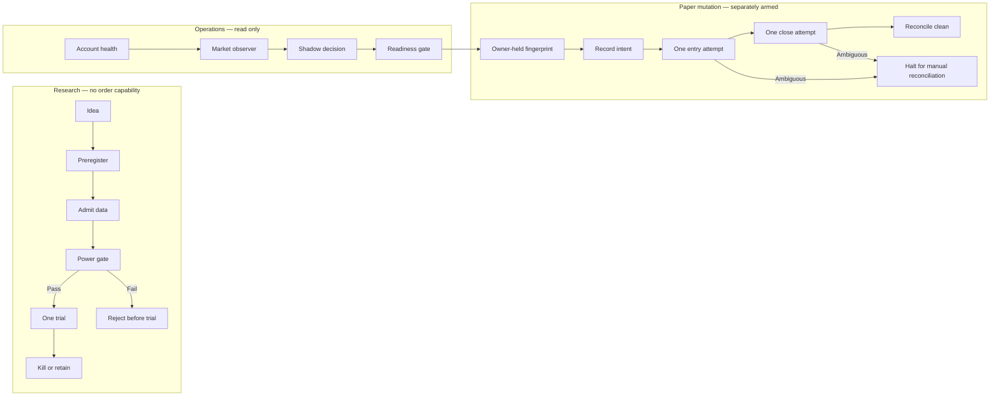

# Architecture

The system separates research, observation, and mutation so that evidence from one layer does not silently authorize another.

## Boundaries

### Research boundary

Research modules may read registered data and calculate registered estimands. They may not import an order-capable component or declare a mutating HTTP method. The private project enforces this through an AST-based regression test.

### Observation boundary

Observers use read-only requests and emit operational aggregates. Reliability reports omit raw prices, sizes, strategy returns, account identifiers, and credentials.

### Mutation boundary

Paper execution is a separately reviewed path. The operator supplies a fingerprint retained outside the workspace. Intent is persisted before mutation. A mutation is never retried after an ambiguous response.

### Reconciliation boundary

Success requires direct final evidence of a clean account. A definitive rejection requires both proof that the client order does not exist and a clean account check. Ambiguity never becomes presumed failure or presumed success.

## What the public demo represents

The included demo is not broker code. It is a pure, credential-free model of the control transitions above. That makes the important behavior reproducible without distributing private operational code or creating an executable trading path.
